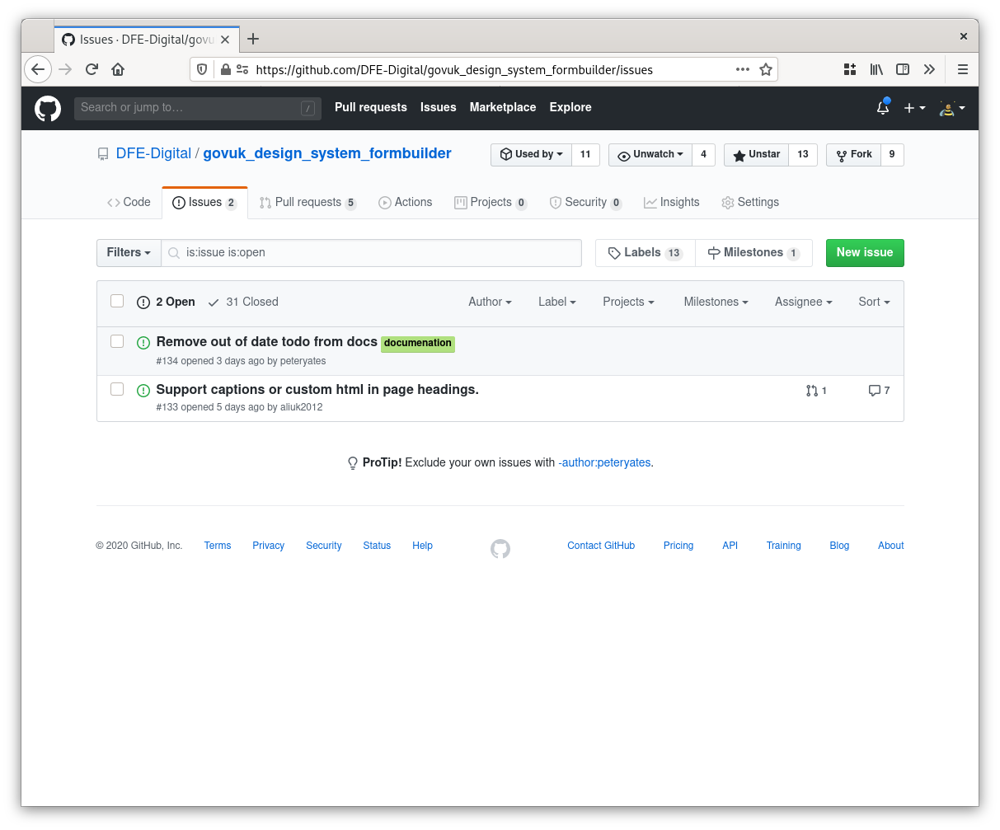
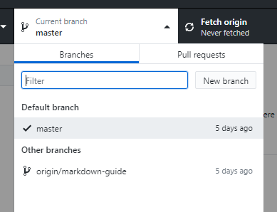
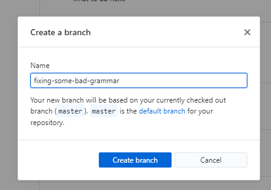
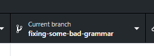
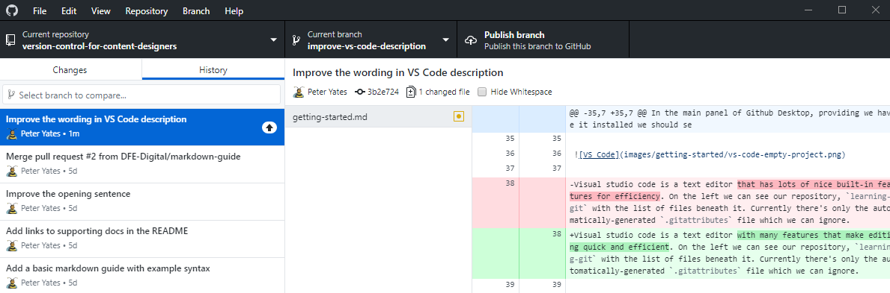
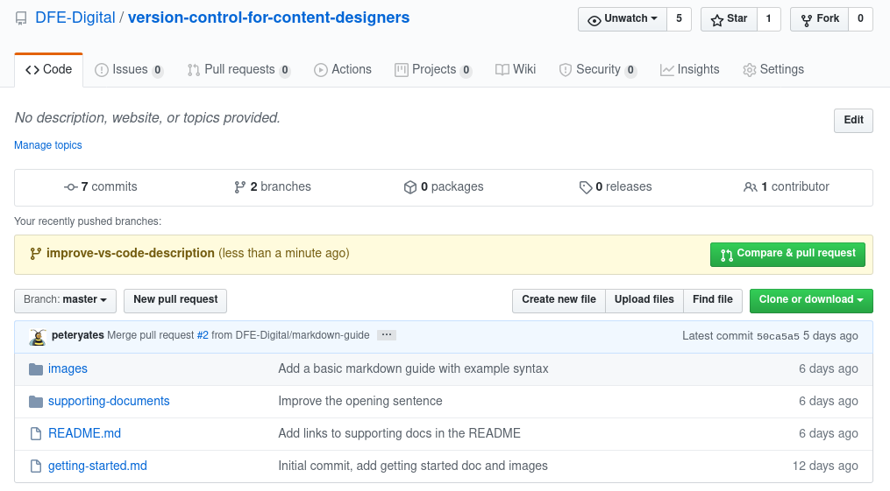
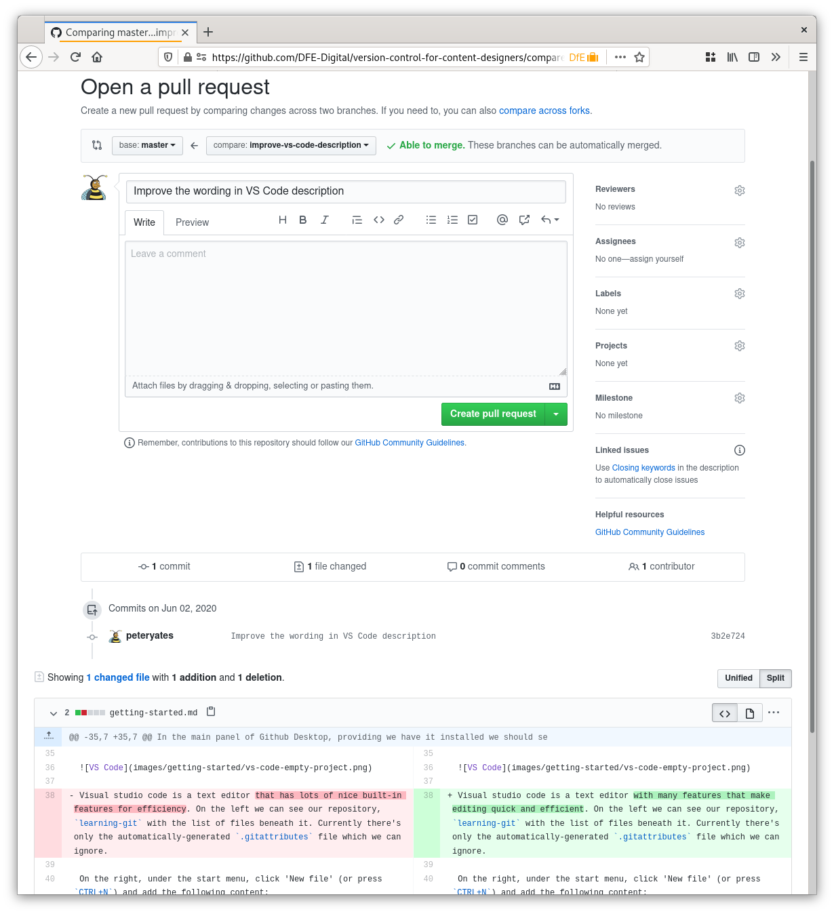
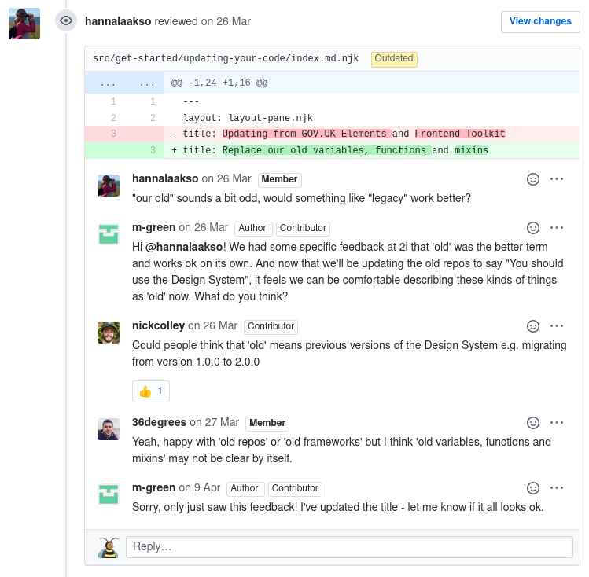
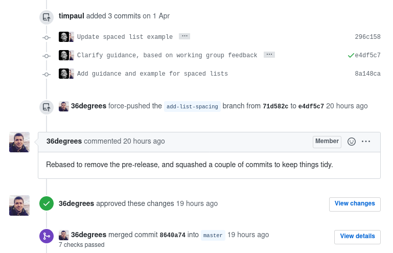

# Collaboration

Now we've mastered [the basics](getting-started.md) we're ready to begin working together. This is where the real power of Git and Github lies. Once repositories have been pushed to Github we can interact with them in a number of ways:

## Issues

Issues are lists of tasks and bugs associated with a project. In most cases, anyone can raise and comment on them but only the original author and project members can close them. In software projects they often describe things that are broken or incorrect, but in content they can suggest improvements to text or [simply point out typos](https://github.com/alphagov/manuals-publisher/issues/1173).

### Creating an issue

Before you create an issue it's important to check that the problem hasn't already been reported. The easiest way to check is to head for the project's 'Issues' tab:

If there are more than a few issues the filter can be used to search. If we don't find any matches, the green 'New issue' button in the top right is our next step. Actually creating the issue is very simple, just give it an title that summarises the problem and then describe the problem with as much information as necessary for someone to find and fix it.

Github supports Markdown throughout, so you can properly format your description with all the skills we learnt in the first session. Github also supports embedding screenshots, just drag or paste them in the issue description.

## Pull requests

Pull requests go a step further than issues in that they allow the reporter to actually suggest the changes. If the team agree they can be _accepted_ and applied to the project. The process of integrating the changes is called _merging_, and the original author's name and commit message are preserved.

Pull requests are the preferred workflow for working on GOV.UK and Department for Education projects.

### Creating a pull request

When you created your repository in [session one](getting-started.md) we noted that the default branch was called `master`. The `master` branch is the project's _main_ branch, it is the definitive view of the repository.

#### Feature branches

To ensure our work is well-organised and logically laid out, we create branches for particular pieces of work, or features. A branch is like a separate copy of the project, we can make our changes without having an impact on anyone else and when we're done, the branch can be evaluated by our colleagues as a single batch of modifications.

To create a new branch, click the branch dropdown in the top bar of Github Desktop and click 'New branch':

| Listing branches | Create a new branch |
| ---------------- | ------------------- |
|  | 

It's helpful to name your branch in a way that will make sense to other people.

Once we've clicked 'Create branch' Github desktop will perform the action and immediately _switch_ us to our new branch.

Now we can go ahead and make our changes. **Any commits will be made to our current branch**.

#### Publishing

Once our branch has some commits and we're happy with our changes, we are ready to publish. Publishing the branch _pushes_ the changes we've made locally to Github so others can see them.

In Github Desktop's toolbar we should see a 'Publish branch' button.

This is a very similar process to we followed when [publishing a new repository](getting-started.md#publishing), but this time the repository is already set up so we don't need to configure anything.

#### Actually creating the pull request

Once publishing has succeeded, when we log into github.com and navigate to our project, we should see a yellow bar across the page:

The green button on the right called 'Compare and & pull request' will begin the process. It will create a pull request from the branch we pushed to the default branch `master`.

Clicking it will open the page where we can describe our batch of changes, add tags and request reviewers.

Again, we can describe our pull request using Markdown formatting and ensure it's clearly laid out so the person who reviews it understands the piece of work as a whole.

Beneath the editing section at the top, github displays a list of our commits and a breakdown of all the changes we've made. It's useful to check that we've covered our original intention before clicking 'Create pull request', but once the PR is created we can continue to push to it until it's been merged.

#### Review and sign-off

Pull requests serve two purposes, they add structure to the merging process and they allow the changes to be discussed and tweaked prior to being merged.

Comments can be added to specific lines of text, changes can be requested and conversations can take place.

Anyone can take part, suggestions can be made in-line, options can be voted on using emoji (👍️ vs 👎️) and when everyone's happy, sign-off can take place.

The pull request screen contains a chronological feed of all associated events. Every comment, push, deployment and approval or rejection is included.

