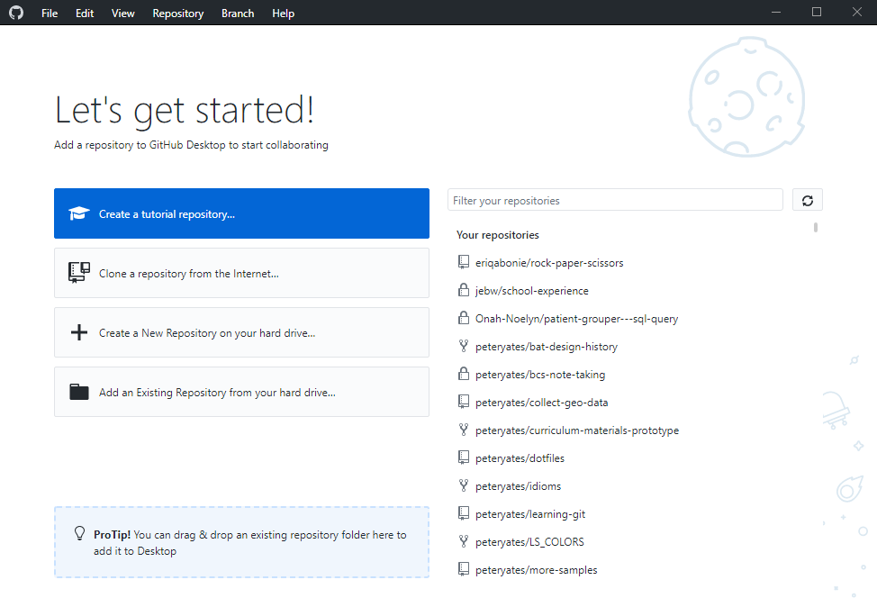
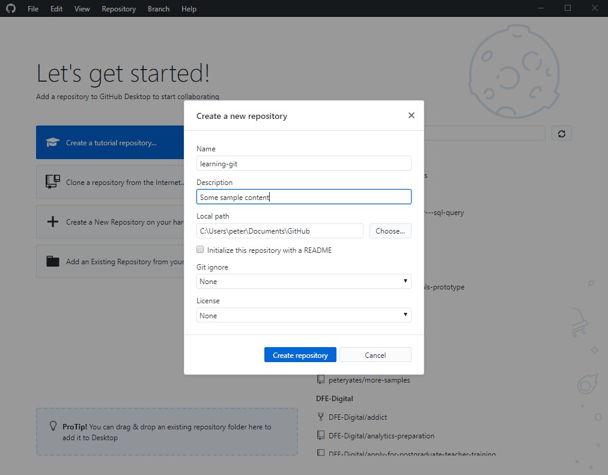
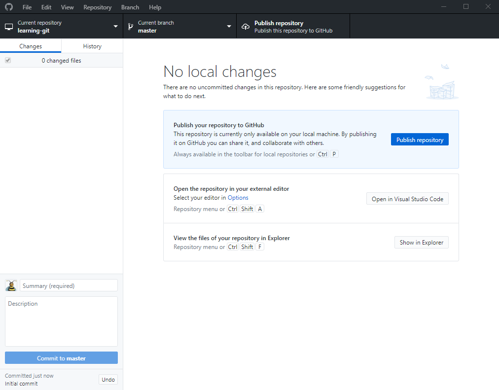
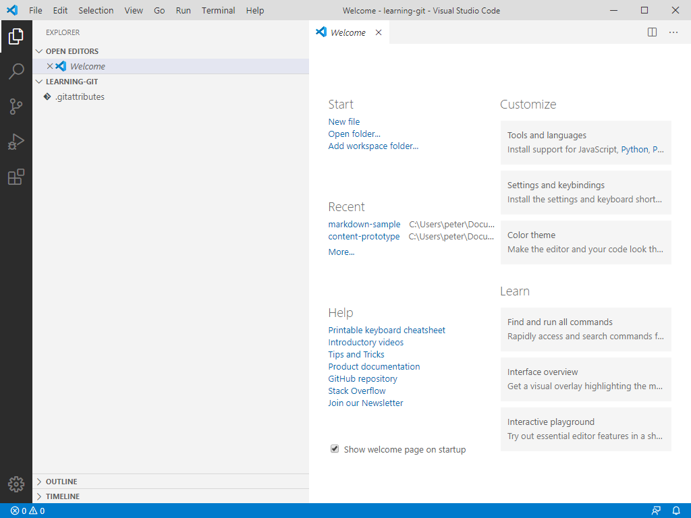
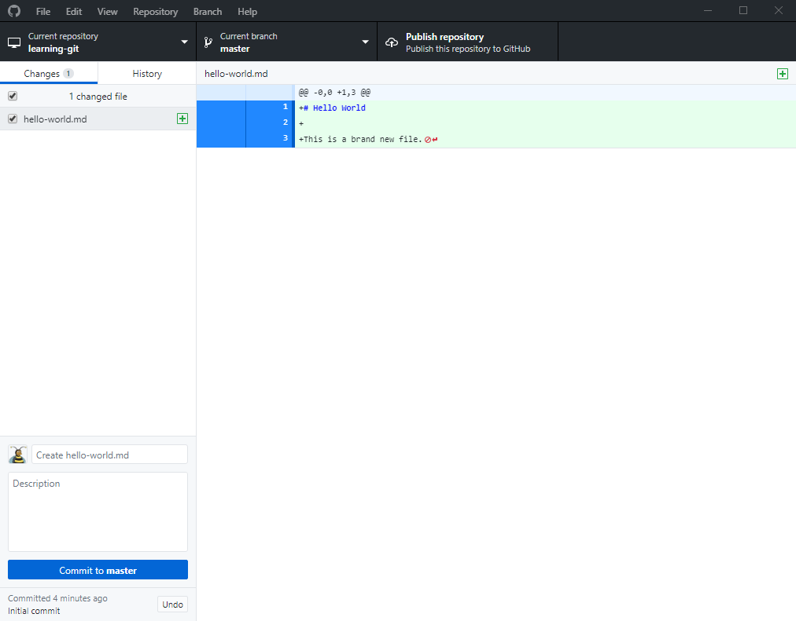
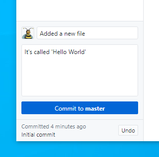
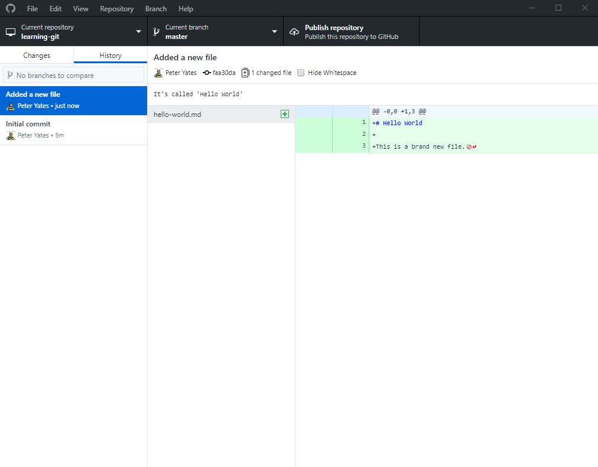
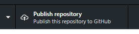
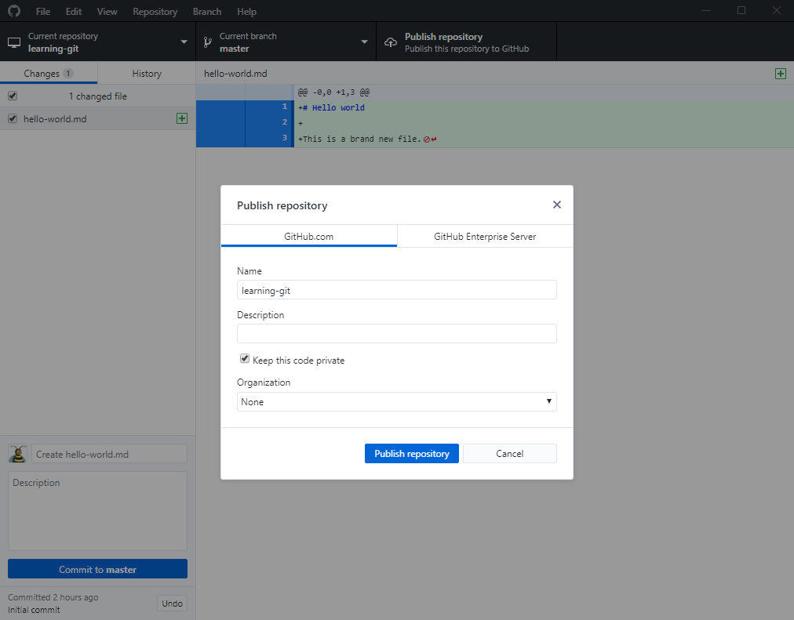
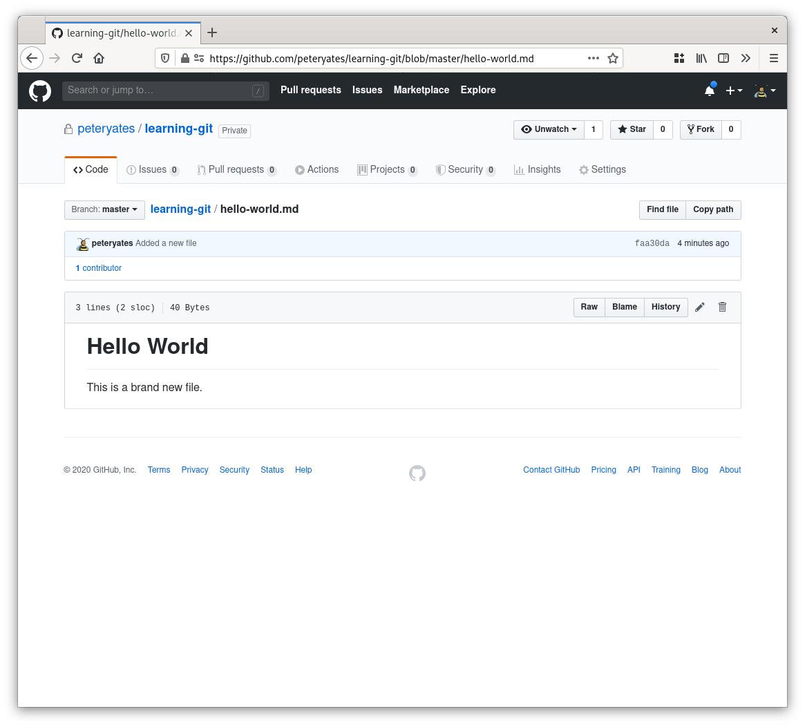

# Getting started

This is a brief course aimed at familiarising content designers with version control.

## Prerequisites

You'll need the following tools installed:

* [Visual Studio Code](https://code.visualstudio.com/)
* [Github Desktop](https://desktop.github.com/)

You will also need a [Github account](https://github.com/join).

## Creating a local repository

When you start Github Desktop for the first time you'll see a window like this.



We're going to create a repository from scratch, so pick the third option and give your repository a suitable name. I'm using `learning-git`.



As you can see, the default local path is `C:\Users\username\Documents\GitHub`, everything we create will be stored here and it's accessible via any program.

Once we click 'Create repository' a folder called `learning-git` will be created and Github Desktop will show you the repository view.



Here we can see an empty repository. We can see our repository name in the top left, and our 'Current branch', `master` in the middle. We'll cover branches in part 2!

## Creating our first file

In the main panel of Github Desktop, providing we have it installed we should see a button that says 'Open in Visual Studio Code'. Clicking it should open the application.



Visual studio code is a text editor that has lots of nice built-in features for efficiency. On the left we can see our repository, `learning-git` with the list of files beneath it. Currently there's only the automatically-generated `.gitattributes` file which we can ignore.

On the right, under the start menu, click 'New file' (or press `CTRL+N`) and add the following content:

```markdown
# Hello world

This is a brand new file.
```

Save with `CTRL+S` and we're going to call it `hello-world.md`. The `.md` extension stands for Markdown and we'll go into a bit more detail on that shortly.

Now, if we go back to Github Desktop we'll notice that our new file has been recognised. We can see the changed files listed on the left and the actual text changes in the pane on the right.



In order to make our change persistent we need to commit it. A commit can contain a single change to one file or updates right across a project. Keeping them small, related and concise is good practice.

To commit, we'll use the button in the bottom left corner, but first we need to type in a commit message. A commit message will tell future editors:

* who made the change,
* when it was made,
* and most-importantly --- **why**



For the time being, let's just say what we've done and commit.

Now, we should be able to see our new commit listed along with the commit message and details about what we changed.



This view can be used to tell us the entire history of a project. We can see and track every change.


## Publishing

If we're working alone or don't want to share our project we can continue to use git locally. Often we do want to share, and that's where Github comes in. Github is a website that allows people to collaborate on and manage projects.

To 'push' our project to github.com we're going to press the 'Publish repository' button on the right side of the top bar.



That will bring up the publishing options. We'll only see this when we're pushing a new project for the first time.



Here we can configure the name our project will have on github.com. This will determine the URL your project has and how people will access it, so choose carefully.

Github projects made available with the following URL scheme: `https://www.github.com/your-username/project-name`. The 'Organization' dropdown at the bottom of the window will allow us to create a project in the DfE's (or any other organisation you're a member of) namespace. If we selected 'DFE-Digital' from that list our project would be published at `https://www.github.com/DFE-Digital/project-name`.

For the time being we'll leave it in our own name and click 'Publish repository'.

We should now be able to browse to our project on Github and see our content.

.
